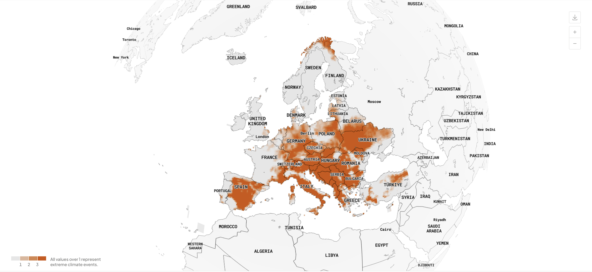

Climate Gazette features stories of extreme weather events that occurred in Europe over the past 40 years. 
Reports are based on data from the <a href="https://climateindex.eu" target="_blank">European Climate Index</a>, analysed with Jupyter and presented via charts and maps.

::: {.stories-grid}

  <a href="E3CI_warm_ott.ipynb">
  

  
  

  </a>
  
Lorem ipsum weather event title

  <a href="E3CI_warm_ott.ipynb">
  

  
  

  </a>
  
Lorem ipsum weather event title

  <a href="E3CI_warm_ott.ipynb">
  

  
  

  </a>
  
Lorem ipsum weather event title

  <a href="E3CI_warm_ott.ipynb">
  

  
  

  </a>
  
Lorem ipsum weather event title

  <a href="E3CI_warm_ott.ipynb">
  

  
  

  </a>
  
Lorem ipsum weather event title

  <a href="E3CI_warm_ott.ipynb">
  

  
  

  </a>
  
Lorem ipsum weather event title

:::

 

  

    E3CI European Extreme Events Climate Index is a project by <a href="https://ifabfoundation.org" target="_blank">IFAB</a>. 
    Implemented by <a href="https://www.cmcc.it" target="_blank">CMCC</a>, <a href="https://leitha.eu" target="_blank">Leithà Gruppo Unipol</a>. Distributed by <a href="https://www.hypermeteo.com" target="_blank">Hypermeteo</a>, and <a href="https://www.radarmeteo.com/en" target="_blank">Radarmeteo</a>.
  

  

  

    <a href="https://datastation.climateindex.eu" target="_blank">datastation.climateindex.eu</a>  &nbsp; &nbsp; &nbsp;
    <a href="https://climateindex.eu" target="_blank">climateindex.eu</a>
    

  

