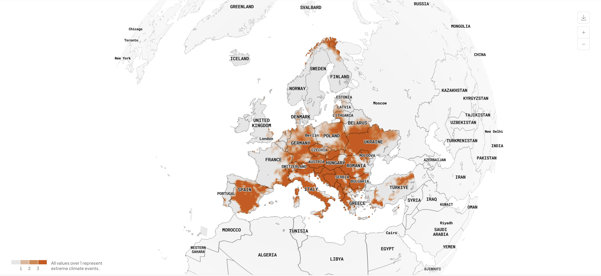

Climate Gazette features stories of extreme weather events that occurred in Europe over the past 40 years. 
Reports are based on data from the <a href="https://climateindex.eu" target="_blank">European Extreme Events Climate Index</a>, analysed with Jupyter and presented via charts and maps.

 

 <iframe
  src="https://player.vimeo.com/video/1229442849?autopause=0&player_id=0&autoplay=1&muted=1&loop=1"
  frameborder="0"
  allow="autoplay; fullscreen; picture-in-picture"
  style="position:absolute;top:0;left:0;width:100%;height:100%;"
  title="Vimeo video">
 </iframe>

 

<h3> 
Issue 1 - November 2026 
</h3>

Developed during the "E3CI Data Station: Visualising Extreme Weather for Decision-Makers and Communities" workshop held at the Visualising Climate Conference 2026, Bologna. 
Curated by <a href="https://www.linkedin.com/in/noemiambrosi/" target="_blank">Noemi Ambrosi</a>, <a href="https://www.linkedin.com/in/simona-contaldi-602b611b6/" target="_blank">Simona Contaldi</a>, and <a href="https://www.linkedin.com/in/cinzia-bongino-b8ab8a7a/" target="_blank">Cinzia Bongino</a>.

::: {.stories-grid}

  
  <a class="story-card-title" href="E3CI_warm_ott.ipynb">Lorem ipsum weather event title</a>

  
  <a class="story-card-title" href="E3CI_warm_ott.ipynb">Lorem ipsum weather event title</a>

  
  <a class="story-card-title" href="E3CI_warm_ott.ipynb">Lorem ipsum weather event title</a>

  
  <a class="story-card-title" href="E3CI_warm_ott.ipynb">Lorem ipsum weather event title</a>

  
  <a class="story-card-title" href="E3CI_warm_ott.ipynb">Lorem ipsum weather event title</a>

  
  <a class="story-card-title" href="E3CI_warm_ott.ipynb">Lorem ipsum weather event title</a>

:::

 

  

    E3CI European Extreme Events Climate Index is a project by <a href="https://ifabfoundation.org" target="_blank">IFAB</a>, <a href="https://www.cmcc.it" target="_blank">CMCC</a>, and <a href="https://leitha.eu" target="_blank">Leithà Gruppo Unipol</a>. Distributed by <a href="https://www.hypermeteo.com" target="_blank">Hypermeteo</a>, and <a href="https://www.radarmeteo.com/en" target="_blank">Radarmeteo</a>.
  

  

  

    <a href="https://datastation.climateindex.eu" target="_blank">datastation.climateindex.eu</a>  &nbsp; &nbsp; &nbsp;
    <a href="https://climateindex.eu" target="_blank">climateindex.eu</a>
    

  

